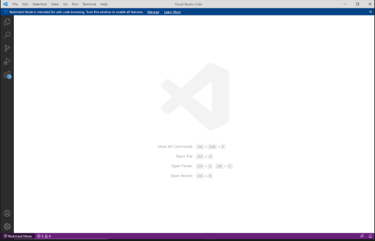
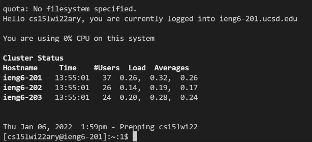
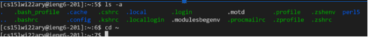
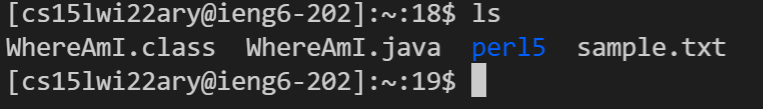
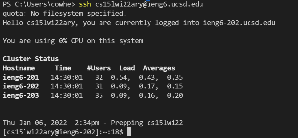
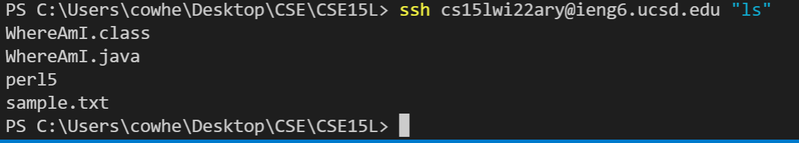
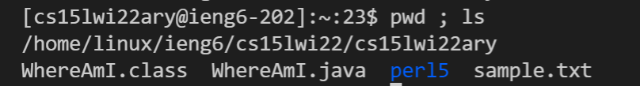

# Lab 1 Report
## Installing VS Code
First we will have to go to the [VS code website](https://code.visualstudio.com/) and click the download button to download VS Code. Then you have to install it. After it is done, you can open VS code and it will look something like this.

## Remotely Connecting
Now we will try to connect remotely. Since I am on windows I will have to install [OpenSSH](https://docs.microsoft.com/en-us/windows-server/administration/openssh/openssh_install_firstuse) and follow the instructions on there. I can check my specific course account right on this [website](https://sdacs.ucsd.edu/~icc/index.php). 
Now I open up the terminal in VS Code. I write this `ssh cs15lwi22zz@ieng6.ucsd.edu` and replace the zz with my own specific course account. After doing so, it will look something like this: 

 

Then it will prompt some questions since we are connecting to the server for the first time so we can just write yes.

## Trying Some Commands

Now we can try to run some commands, such as `cd ~` or `ls -a` 

Here is one command I will run: `ls -a` which will list all the files in my current directory.

## Moving Files with scp
To move files from your local computer to the remote computer we can use the `scp` command. Let's say we create file named `sample.txt`

From the same directory we created the file, we run this command `scp sample.txt cs15lwi22<your course account here>@ieng6.ucsd.edu:~/`

Login again and it will be on your remote computer. I will use ls and see that is is indeed in the remote computer:

## Setting an SSH Key
We will set a SSH key so everytime we connect remotely we will not have to enter our password. To do this I first run the command `ssh-keygen` on my local computer. Since I am on windows I will have to follow the [additional steps](https://docs.microsoft.com/en-us/windows-server/administration/openssh/openssh_keymanagement#user-key-generation). Now my system will have a public key (in .ssh directory) which I need to copy to my remote computer. This means after logging in into the remote computer I type these commands: 
`mkdir .ssh` which creates a directory called .ssh in my remote computer.
Now I logout by pressing `Ctrl+D` together.
Now I need to copy my public key in my local computer to the remote computer: 

`scp /Users/<your_name>/.ssh/id_rsa.pub cs15lwi<course_account>@ieng6.ucsd.edu:~/.ssh/authorized_keys`

Now we can see that when I ssh to the server I do not need to enter my password.

### Optimizing Remote Running

We can also login and execute a command in one line: `ssh cs15lwi22<your_account>@ieng6.ucsd.edu "ls-a"` will first login and then list all the files in the current remote directory and then log out.  

We can also run multiple commands on the same line and seperate each command by a semicolon.

Here is an example, where I run pwd and ls in the same line, both seperated by a semicolon.

