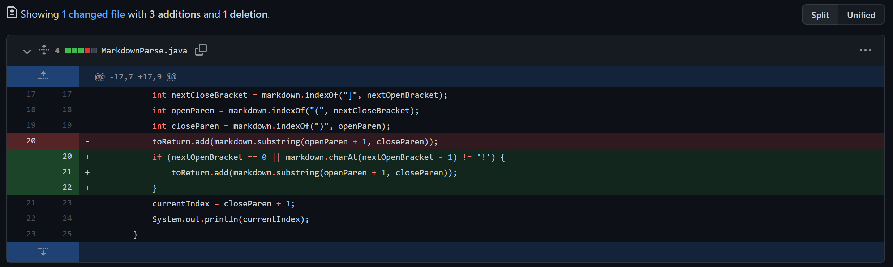
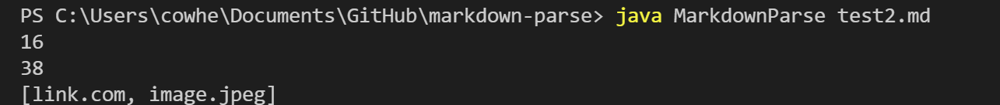
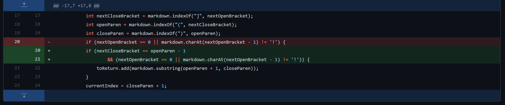
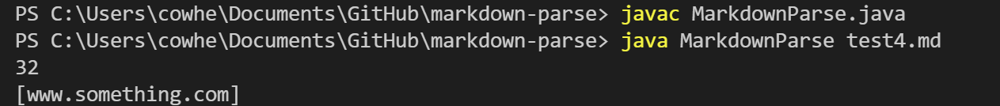
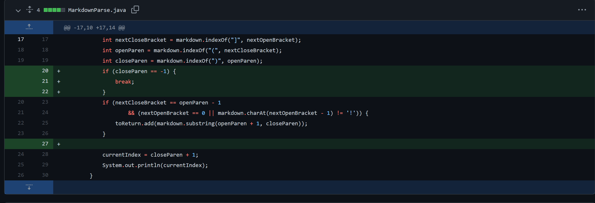
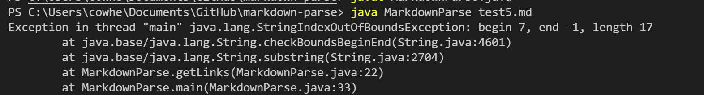

# Lab 2 Report
# First Change
The first change we made was that we want to make sure images are no longer included in the array list.
For example: `````` should not be interpreted as a link.




[Link to test file](https://github.com/leeandrew1/markdown-parse/blob/13ebead16e5065f6834970d38ada05f41c690a03/test2.md)



In this part of the code, the sympton was that it would print an answer that is not correct, since we do not want to include images in our array list. The bug was that we did not check for an exclamation mark before the initial bracket, which means an image in markdown.


# Second Change
The second change we made was that there should be no spaces between the closed bracket and the open parenthesis, so for example: ```[link] words (www.something.com)``` should not be counted as a valid link.



[Link to test file](https://github.com/leeandrew1/markdown-parse/blob/13ebead16e5065f6834970d38ada05f41c690a03/test4.md)



The bug was that we did not check for the closed bracket to be in the position of the open paranthesis subtracted by one. The symptom is that the failure-inducing input was included in our array list even though it does not follow the format of a link.


# Third Change
This change fixed cases where there is no ending parenthesis, so links like ```[link](link``` would result in an out of bounds error. 



[Link to test file](https://github.com/leeandrew1/markdown-parse/blob/13ebead16e5065f6834970d38ada05f41c690a03/test5.md)



The index out of bounds is the symptom and it is produced by the bug on the line where we are adding our link into our array list:  ```toReturn.add(markdown.substring(openParen + 1, closeParen))```. This means that if our closed parenthesis does not exist, then closeParen will have a value of -1.  
