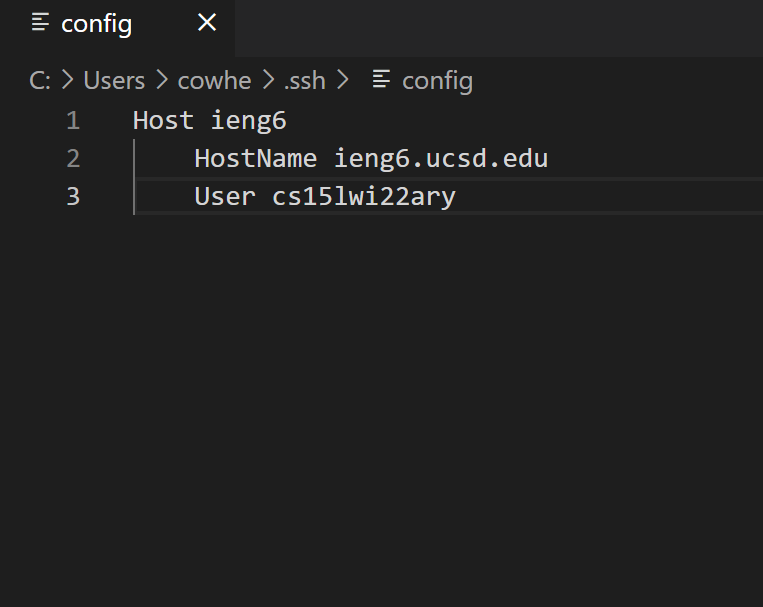
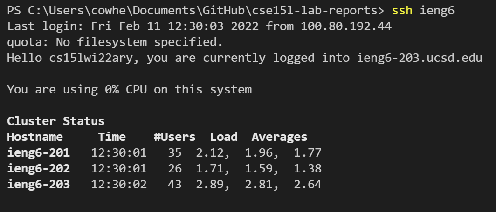
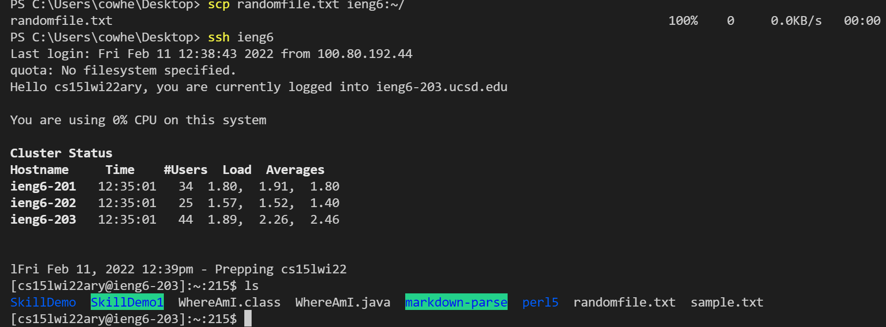

# Lab Report 3 

## Option 1: Streamlining ssh configuration

Here is my ```.ssh/config file```. I edited it by opening the file through VS Code 




In the picture, I have set my alias as ```ieng6```.
 
Now I can login by typing ```ssh ieng6``` as shown here: 




I can also use the ```scp``` command with the alias. I have created a sample file named ```randomfile.txt```. I will now run the ```scp``` command: 

```scp randomfile.txt ieng6:~/```

We can now see that the file, ```randomfile.txt``` has been copied to my ieng6 account:

