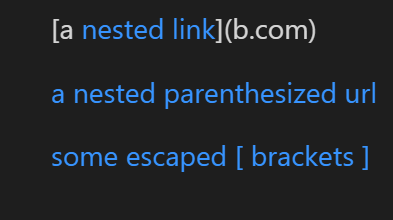
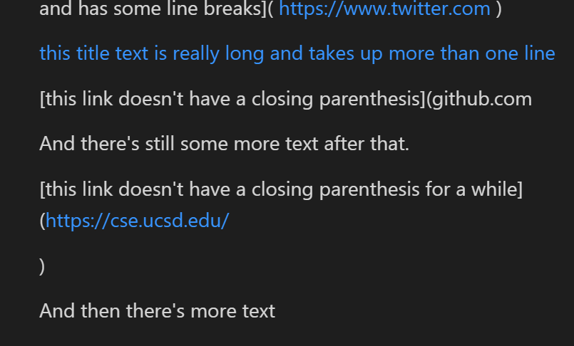
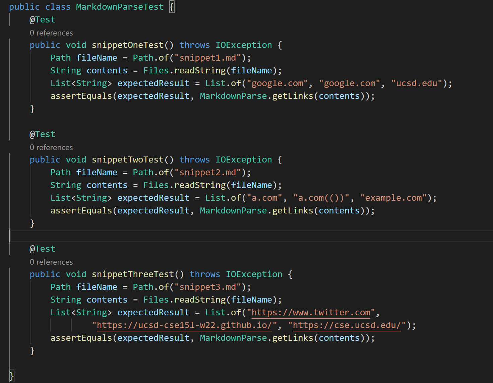
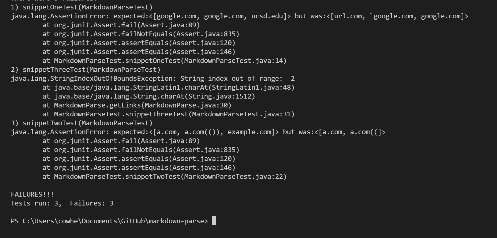
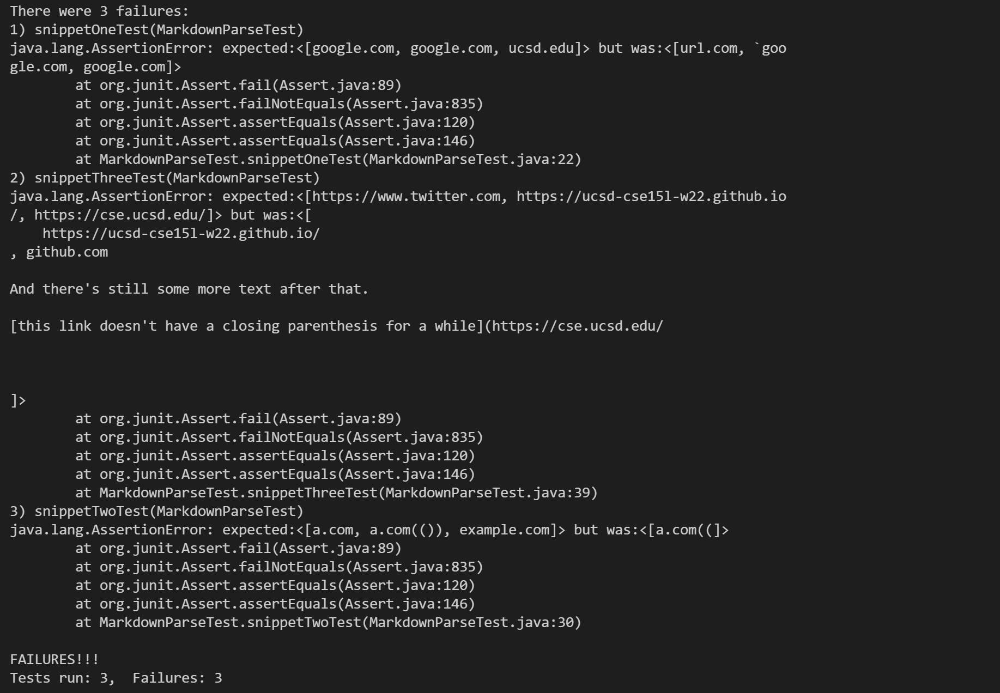

## Snippet 1
For snippet 1, the expected links, based on VS code preview, are the ones highlighted in blue:

So that means we expect the following to be links: 
``` 
google.com 
google.com 
ucsd.edu
```

<br/>

## Snippet 2
For snippet 2, here is the VS code preview: 

And the expected links are 
```
a.com 
a.com(())
example.com
```

<br/>

## Snippet 3
For snippet 3, here is the VS code preview:

And the expected links are 
```
https://www.twitter.com
https://ucsd-cse15l-w22.github.io/ 
https://cse.ucsd.edu/
```


Here is how I implemented the tests for both the other group's implementation and mine:




Here is what my tests look like and all of them failed:

For the snippet test one and two, there was an ```java.lang.AssertionError``` since the expected values do not match the actual values.
For the snippet test three case, there was an index out of bounds error: ```java.lang.StringIndexOutOfBoundsException```


Here is what the tests look like for the other group and all the tests have failed also.


For the all three cases, it seems like there is an ```java.lang.AssertionError```.


<br/>

<br/>


1. I do not think there is a small (<10) code change that can make my code work for snippet one. From the tests, I see that ```url.com``` is included while ```ucsd.edu``` is not. I would have to check whether or not a backtick exists before an open bracket does and if so, that part of the code (from beginning of the backtick to the ending of the backtick) shouldn't be interpreted as a link. Additionally, the case for ```[`code]`](ucsd.edu)``` would take more than 10 lines as I would have to check for matching backticks for the string between the open and outer closed bracket. There can also be other cases, such as a backtick in the middle of the link. I believe the changes to adjust for all backtick cases would take more than 10 lines.

2. I believe there is a not small code change to make my code work for snippet two. Based on the tests, it seems almost correct except I am just missing some parantheses. However, I believe this will take more than 10 lines because we could have to check for nested parantheses, brackets, and escaped brackets in the URL part. Additionally my code did not detect example.com, which meant it does not have any code that deals with nested brackets so far. All in all, the changes will take over 10 lines. 

3. I do not think there is a small code change that can make my code for work snippet three. Based on the tests, I am getting an out of bounds error. This means that I will have to add more lines to check if I not out of bounds. Also I have to handle multiple cases when we encounter a new line. There could be a new line in the middle of an open parantheses, text, and many more other scenarios. Because of this, I think it will take more than 10 lines.