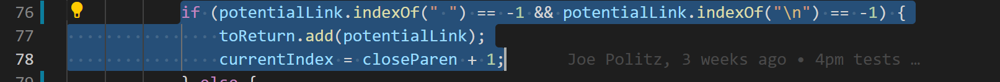
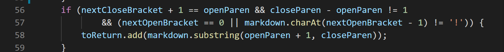

# Lab Report 5

To find the tests with the different results, I ran a bash script that ran each of the 652 tests and then used the diff command to compare the two resultant text files.


The two tests that I have decided to write about are:

    201.md
    567.md


<br/>
<br/>
<br/>

## 201.md's contents:
```
[foo]: <bar>(baz)

[foo]
```

My output: ```[]```

Lab 9's output: ```[baz]```

Expected output: ```[]```

I believe the expected output should be an empty arraylist, because ```[foo]: <bar>(baz)``` does not follow the format for a link, as ```<bar>``` interrupts the correct format.


Here is the image of what is causing the bug:


The bug for the wrong implementation is that when we add a potential link into our array list, we should make sure that the character after the closing bracket is an open paranthesis. That means the code should have checked ```if (nextCloseBracket + 1 == openParen)``` before adding our potential link into the result. It seems as if the current implementation does not check for that and is why it considers baz to be a link, even though the format is wrong.


<br/>
<br/>
<br/>


## 567.md's contents:
```
[foo](not a link)
[foo]: /url1
```

My output: ```[not a link]```

Lab 9's output: ```[]```

Expected output: ```[]```

I believe the expected output should be an empty array list. This is because ```(not a link)``` is not a link since it has spaces in the string in between the open and the closed paranthesis.

Here is the image of what is causing the bug:


I think what's wrong with my code is that currently, there is not code that checks whether or not the potential links are actually valid. As of now, it just seems to append the string in between the inndices of the open parenthesis and the closed paranthesis. In order to fix this, I would have to check whether the string inside the open and closed paranthesis is a valid link. To be more specific, I would have to check to make sure there are no spaces within that string, and if it is actually valid, then I can append that result into our arraylist.